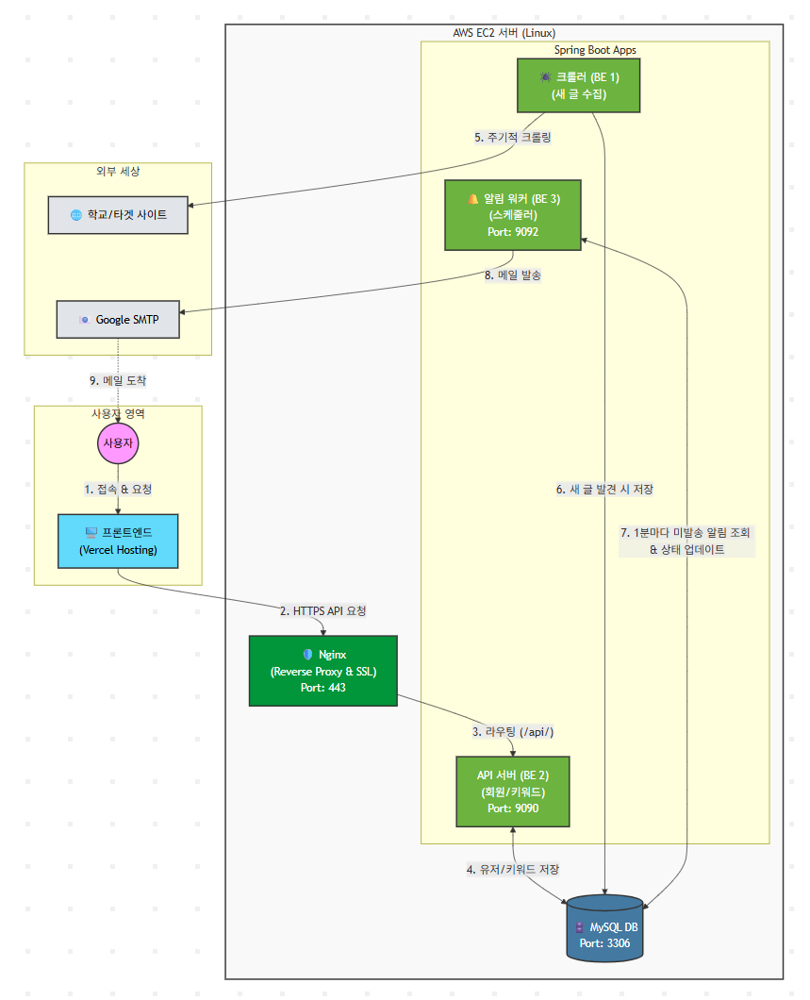
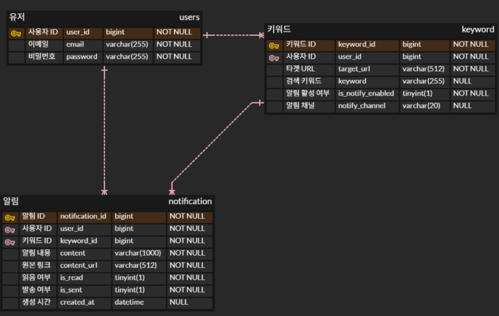

# 🎯 Key-Catch: API Server (Backend)

<br>

> **"흩어진 정보를 하나로 잇다, Key-Catch"**

**Key-Catch**는 정보 과잉 시대에 사용자가 원하는 키워드만 등록하면 24시간 웹을 감시하여 알림을 제공하는 **개인화 정보 구독 서비스**입니다.  
본 리포지토리는 서비스의 핵심 로직을 담당하는 **API Server**의 소스 코드를 포함하고 있습니다.

<br>

## 🏗️ System Architecture

본 프로젝트는 **안정성(Stability)** 과 **확장성(Scalability)** 을 최우선으로 고려하여 **MSA (Microservices Architecture)** 구조를 채택했습니다.

### 🔹 Service Architecture


* **API Server (This Repo)**: 사용자 인증/인가, 키워드 관리, 프론트엔드와의 통신 담당
* **Crawler Server**: 데이터 수집 및 중복 제거
* **Notification Server**: 이메일 발송 및 상태 관리
* **MySQL (Shared DB)**: 3개의 서버가 데이터를 공유하며 비동기적으로 상태를 동기화

<br>

### 🔹 Database ERD
**API Server, Crawler, Notifier** 3개의 서버가 데이터를 공유하는 모델입니다.  
**User(사용자)** 를 중심으로 **Keyword(구독 정보)** 와 **Notification(알림 발송 내역)** 이 `1:N` 관계로 설계되어 있습니다.



<br>

## 🔥 Key Features (핵심 구현 내용)

본 프로젝트는 **유지보수성(Maintainability)** 과 **데이터 무결성(Data Integrity)** 을 최우선으로 하여, Spring Boot의 표준 계층형 아키텍처(Layered Architecture)를 기반으로 설계되었습니다.

### 1. JWT 기반의 Stateless 보안 아키텍처
> **관련 모듈**: `config/SecurityConfig`, `JwtTokenProvider`, `JwtAuthenticationFilter`

* **Stateless 인증 구현**: 세션 서버 부하를 줄이기 위해 **JWT(Json Web Token)** 방식을 채택했습니다.
* **커스텀 필터 체인 (Security Filter Chain)**:
    * `JwtAuthenticationFilter`를 `UsernamePasswordAuthenticationFilter` 앞단에 배치하여, 모든 API 요청 진입 시 토큰의 유효성(Signature, Expiration)을 먼저 검증하도록 설계했습니다.
    * `SecurityConfig`에서 **BCrypt** 암호화를 적용하여 비밀번호 유출 시 보안성을 강화했습니다.

### 2. DTO와 Entity의 철저한 분리 (데이터 안정성)
> **관련 모듈**: `domain/*`, `dto/*`

* **설계 의도**: 데이터베이스와 직접 매핑되는 **Entity 클래스**(`User`, `Keyword`)가 API 응답으로 노출될 경우 발생하는 보안 문제와 순환 참조 이슈를 방지했습니다.
* **구현 내용**:
    * **Request/Response DTO 분리**: `SignupRequest`, `TokenResponse`, `UnreadCountResponse` 등 목적에 맞는 DTO를 별도로 정의했습니다.
    * **OIM(Object Impedance Mismatch) 해결**: Controller 계층에서 Entity를 직접 받지 않고, 반드시 DTO를 통해 데이터를 주고받도록 강제하여 비즈니스 로직의 독립성을 확보했습니다.

### 3. 책임의 분리를 통한 계층형 아키텍처 (Layered Architecture)
> **관련 모듈**: `controller`, `service`, `repository`

* **Controller**: 요청 값의 유효성 검증(Validation)과 응답 반환 역할에만 집중합니다.
* **Service**: `@Transactional`을 사용하여 데이터 변경의 원자성(Atomicity)을 보장하고, 핵심 비즈니스 로직을 수행합니다.
* **Repository**: JPA를 사용하여 DB 접근 로직을 추상화했습니다.
* **기대 효과**: 각 계층의 역할이 명확하여, 추후 기능 확장이나 유지보수 시 코드 수정 범위를 최소화할 수 있습니다.

### 4. API 문서 자동화 및 협업 최적화
> **관련 모듈**: `config/SwaggerConfig`

* **Swagger (OpenAPI) 도입**: `SwaggerConfig`를 통해 API 명세서를 코드 레벨에서 자동화했습니다.
* **협업 효율 증대**: 프론트엔드 개발자가 별도의 문서 요청 없이도 실시간으로 변경된 API 스펙을 확인하고 테스트할 수 있는 환경을 구축했습니다.

<br>

## 📂 Project Structure

```bash
com.chosun.demoversion
│
├── DemoversionApplication.java        # Main Execution File
│
├── config                             # Configuration (Security, Docs, Utils)
│   ├── SecurityConfig.java            # Spring Security & CORS Setup
│   ├── SwaggerConfig.java             # Swagger API Documentation
│   ├── JwtTokenProvider.java          # JWT Token Generation & Validation
│   └── JwtAuthenticationFilter.java   # JWT Auth Filter
│
├── controller                         # API Layer (Request/Response)
│   ├── AuthController.java            # Login, Signup
│   ├── KeywordController.java         # Keyword Operations
│   └── NotificationController.java    # Notification Operations
│
├── domain                             # Entity Layer (DB Mapping)
│   ├── User.java
│   ├── Keyword.java
│   └── Notification.java
│
├── dto                                # DTO (Data Transfer Object)
│   ├── SignupRequest.java
│   ├── LoginRequest.java
│   ├── TokenResponse.java
│   ├── KeywordRequest.java            
│   └── NotificationResponse.java      
│
├── repository                         # JPA Repository Layer
│   ├── UserRepository.java
│   ├── KeywordRepository.java
│   └── NotificationRepository.java
│
└── service                            # Business Logic Layer
    ├── AuthService.java
    ├── KeywordService.java
    └── NotificationService.java
